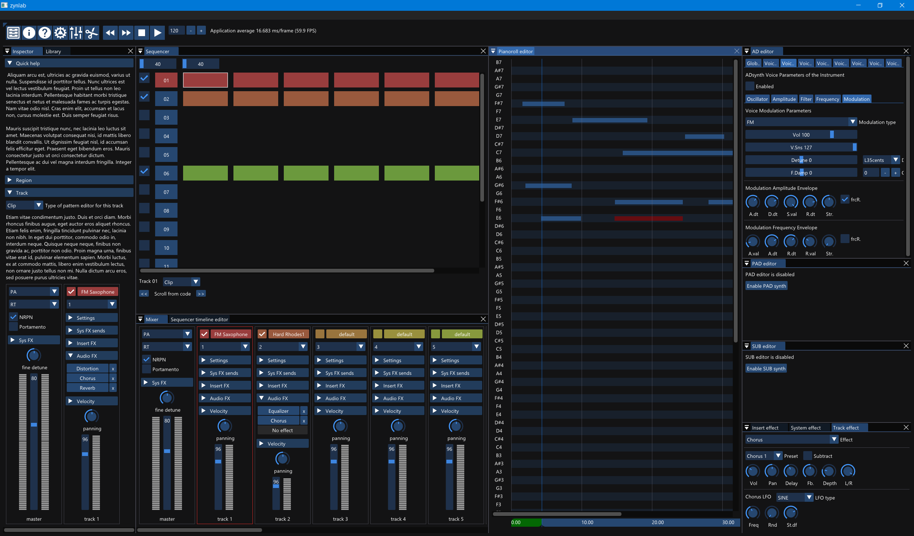
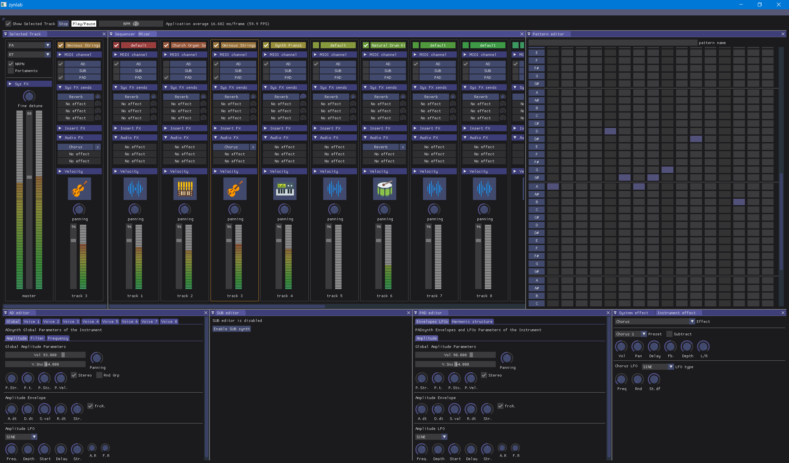
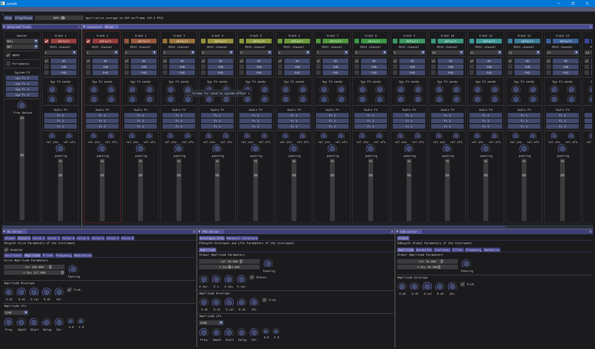

# zynlab

Rearrangement of the zynaddsubfx classes and seperated into libraries.

First run cmake, then build the "fluid" target (so fluid.exe is available) then re-run cmake. 

```
set root_dir=%CD%
set "root_dir=%root_dir:\=/%"

git clone https://github.com/wtrsltnk/zynlab.git --recursive 
git clone https://github.com/wtrsltnk/zynaddsubfx-deps.git

mkdir zynlab-build

cd zynlab-build
cmake -DCMAKE_PREFIX_PATH=%root_dir%/zynaddsubfx-deps/mingw-32bit -DCMAKE_MODULE_PATH=%root_dir%/zynaddsubfx-deps/mingw-32bit/cmake-modules -G "MinGW Makefiles" ../zynlab
cmake --build ./
cd ../

robocopy "zynaddsubfx-deps/mingw-32bit/bin" zynlab-build/app *.dll
robocopy "zynaddsubfx-deps/mingw-32bit/bin" zynlab-build/app.threedee *.dll
```

Build FLTK for vc++ ::

```
cmake -G "Visual Studio 16 2019" -D CMAKE_BUILD_TYPE=Release` -D FLTK_BUILD_TEST=OFF -D OPTION_BUILD_HTML_DOCUMENTATION=OFF -D OPTION_BUILD_PDF_DOCUMENTATION=OFF -D "CMAKE_INSTALL_PREFIX=C:\Program Files (x86)\Microsoft Visual Studio\2019\Community\VC\Tools\MSVC\14.29.30133" ..
cmake --build .
cmake --install .
```

Also added some UI ideas:






